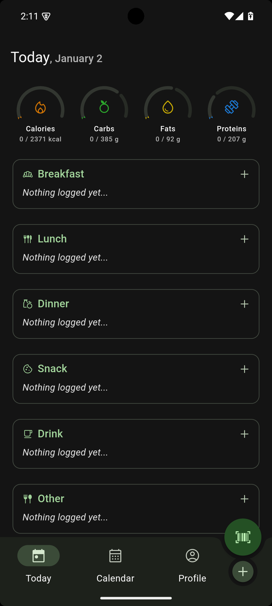
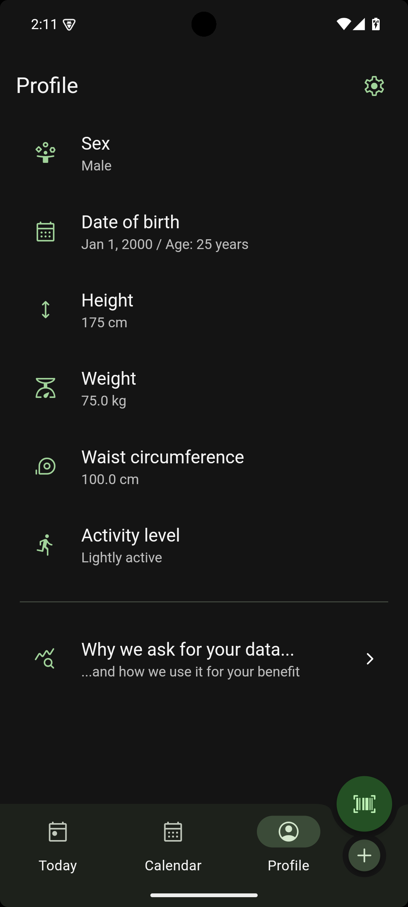
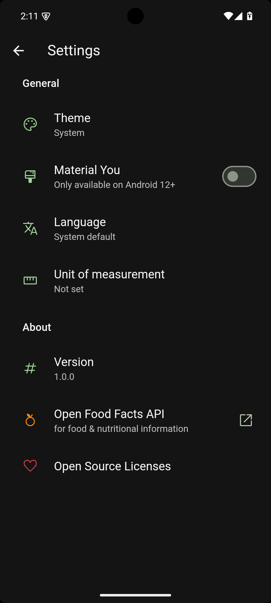
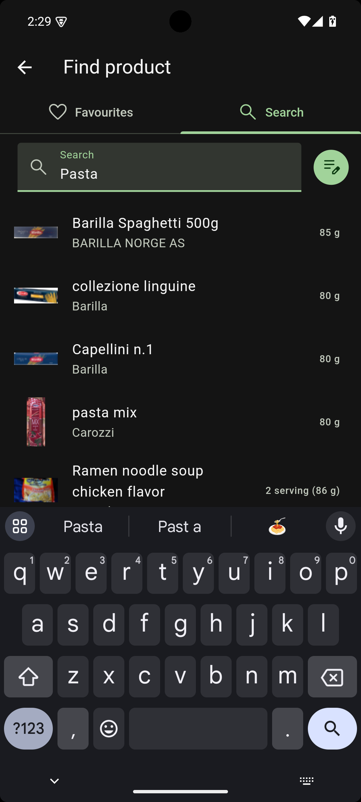
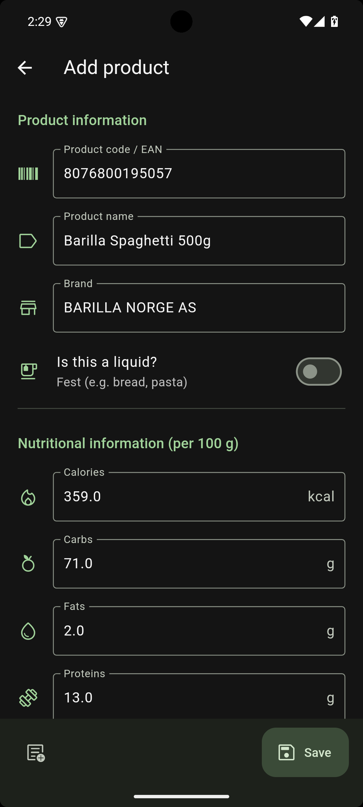
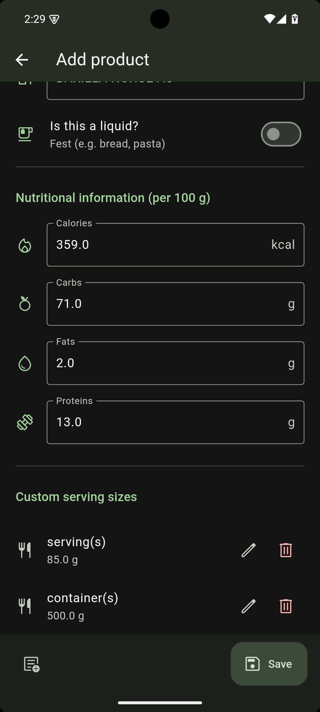
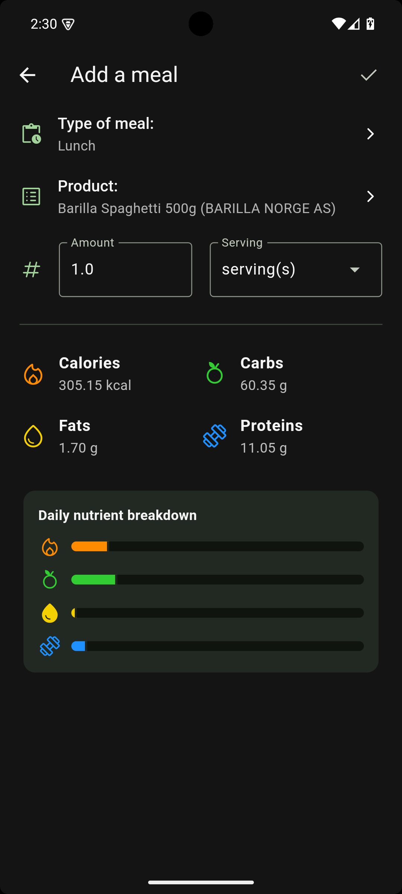

[](https://github.com/Tim-Otte/calorie-counter/actions/workflows/dart.yml)

# Calorie Counter

A Flutter-based application for tracking daily calorie intake.

## Features

- Log daily meals and calorie consumption
- View historical data and trends
- Set and monitor calorie goals

## Screenshots
|  |  |  |
|       :---:      |       :---:      |       :---:      |
|  **Today page**  | **Profile page** | **Settings page**|

<details>

<summary>More screenshots...</summary>

|  |  |  |  |
|       :---:      |       :---:      |       :---:      |       :---:      |
|**Product search**|**Product edit 1**|**Product edit 2**|   **Add meal**   |

</details>

## Getting Started

1. **Clone the repository:**
   ```bash
   git clone https://github.com/Tim-Otte/calorie-counter.git
   ```

2. **Navigate to the project directory:**
   ```bash
   cd calorie-counter
   ```

3. **Install dependencies:**
   ```bash
   flutter pub get
   ```

4. **Generate the app icons:**
   ```bash
   flutter pub run flutter_launcher_icons
   ```

5. **Run the app:**
   ```bash
   flutter run
   ```

## Localization
Supports multiple languages. To add more, modify the ARB files in `lib/src/localization/`.

Currently supporting:
- English
- German

## Contributing
Contributions are welcome. Please fork the repository and create a pull request.

## Acknowledgements
This app uses the [OpenFoodFacts](https://world.openfoodfacts.org/) food database to provide detailed nutritional information. I am very grateful for their service and the valuable data they provide.